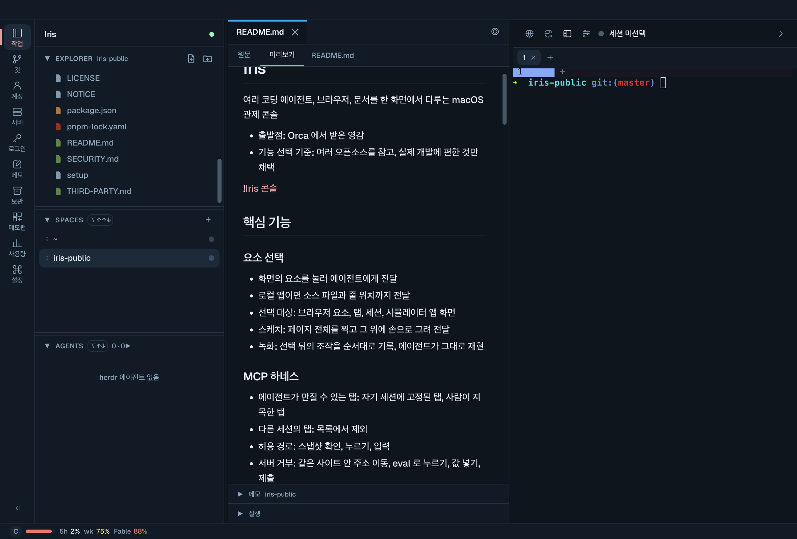
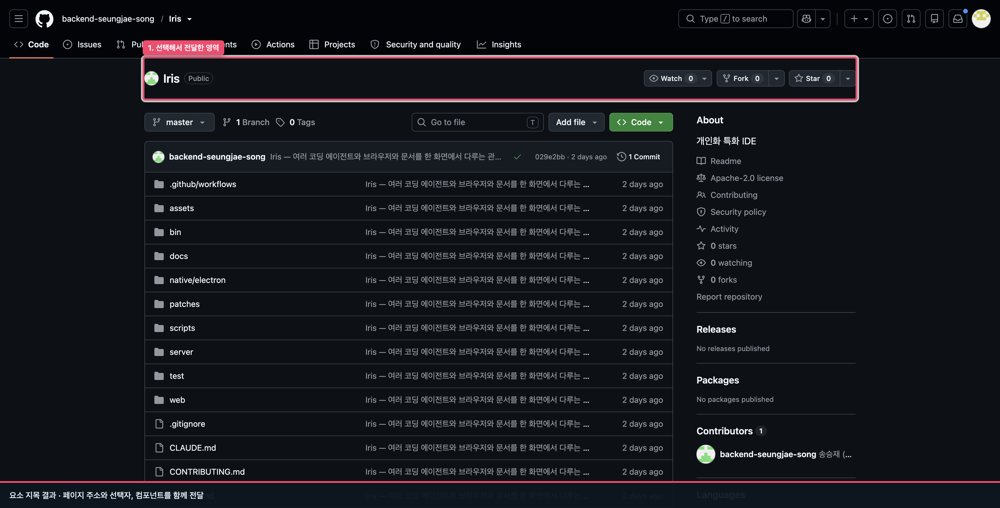
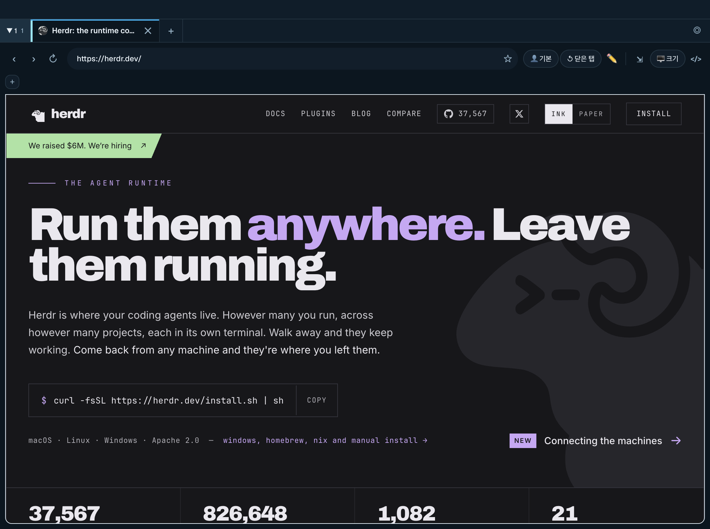
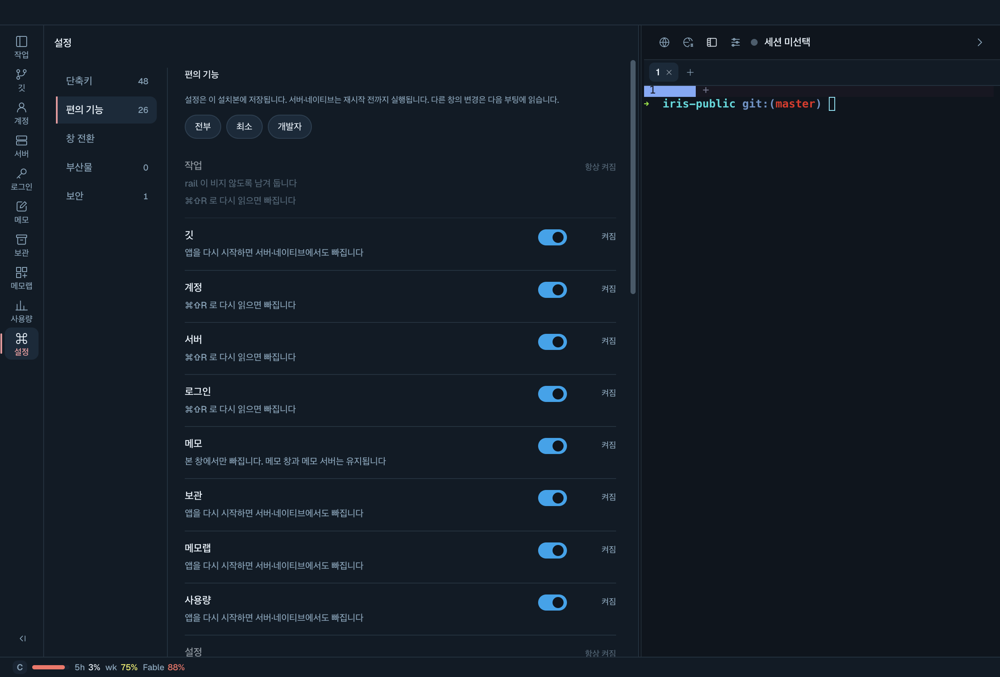

# Iris

여러 AI 에이전트의 작업을 확인하고, 브라우저에서 수정할 부분을 직접 짚어 주세요.

Iris에서 Claude Code와 Codex 세션을 프로젝트별로 관리하고, 작업 중인 웹페이지와 파일을 함께 볼 수 있습니다. 화면의 요소를 선택하거나 오류가 발생하는 조작을 기록해 에이전트에게 전달할 수 있습니다.

macOS 14 이상과 Apple Silicon Mac이 필요합니다. 현재는 소스를 내려받아 설치합니다.

[설치하기](#설치하기) · [비개발자 튜토리얼](docs/tutorials/non-developers.md) · [개발자 튜토리얼](docs/tutorials/developers.md)



파일을 열어 읽으면서 같은 창의 터미널에서 작업할 수 있습니다. 위 이미지는 에이전트를 선택하기 전 화면입니다.

## 이런 작업에 사용할 수 있습니다

| 하려는 일 | Iris에서 할 수 있는 일 |
|---|---|
| 웹페이지 수정을 요청하기 | 버튼이나 문구를 직접 선택해 에이전트에게 전달하기 |
| 오류가 발생하는 과정을 설명하기 | 클릭과 입력 순서를 기록해 재현 절차 전달하기 |
| 여러 에이전트에게 작업을 나누기 | 프로젝트별 세션을 선택하고 각 터미널의 진행 상황 확인하기 |
| 수정 결과를 확인하기 | 웹페이지, 변경 파일, diff를 같은 앱에서 확인하기 |
| 업무용 계정과 개인 계정을 구분하기 | 브라우저 프로필별로 로그인 세션 분리하기 |

## 여러 에이전트의 작업 확인하기

프로젝트를 선택하고 Claude Code나 Codex 세션을 여세요. 한 세션에서 화면을 수정하는 동안 다른 세션에서 관련 코드를 검토하도록 작업을 나눌 수 있습니다. 왼쪽 **AGENTS**에서 세션을 선택하면 해당 터미널로 전환됩니다.

선택한 세션에 화면의 요소와 조작 기록이 전달되므로, 요청을 보내기 전에 대상 세션을 확인하세요. 세션과 스페이스는 보관했다가 복원할 수 있습니다.

## 화면을 짚어 수정 요청하기



위 화면은 실제 지목 결과에 설명용 테두리를 덧붙인 것입니다. 이 영역을 선택하자 페이지 주소, 선택자 `div.tmp-pt-3.tmp-pb-3`, React 컴포넌트 `CodeViewHeader`가 에이전트에게 전달됐습니다.

에이전트 세션을 선택하고 브라우저에서 `⌘⇧E`를 누른 뒤 수정할 요소를 클릭하세요. “이 버튼의 문구를 ‘예약하기’로 바꿔 줘”처럼 선택한 대상을 기준으로 요청할 수 있습니다. 로컬 앱에서 소스 위치를 찾을 수 있으면 파일과 줄 번호도 함께 전달됩니다.

화면에 직접 표시하고 싶을 때는 `⌘⇧D`로 스케치를 엽니다. 위치나 모양에 관한 요청을 그림으로 덧붙일 수 있습니다.

[비개발자 튜토리얼에서 화면을 선택하고 질문하기](docs/tutorials/non-developers.md)

## 오류가 발생하는 과정 전달하기

문제가 생기는 페이지에서 `⌘⇧A`를 누르고 클릭과 입력을 수행하세요. 같은 단축키로 종료하면 선택한 에이전트에게 조작 기록이 전달됩니다. 기대한 결과와 실제 결과를 함께 적으면 같은 순서로 확인하도록 요청할 수 있습니다.

조작 기록은 재현 절차를 전달하는 기능이며 동영상 파일 저장과는 다릅니다. 이 문서의 단축키는 기본값이며 **설정 → 단축키**에서 현재 값을 확인할 수 있습니다.

[개발자 튜토리얼에서 수정 요청부터 결과 확인까지 따라 하기](docs/tutorials/developers.md)

## 프로젝트별로 브라우저와 계정 나누기



프로젝트마다 탭과 북마크를 따로 유지할 수 있습니다. 여러 프로젝트에서 계속 볼 자료는 공유 브라우저 창에 열어 두세요. 프로필을 바꾸면 쿠키와 로그인 세션도 구분됩니다.

페이지 번역, 최근 닫은 탭 복원, React 개발자 도구도 사용할 수 있습니다. 에이전트의 브라우저 조작 대상은 해당 세션에 연결되거나 사용자가 지목한 탭으로 제한됩니다.

## 수정 결과와 파일 확인하기

에이전트의 작업이 끝나면 브라우저에서 바뀐 화면을 확인하고 **깃**에서 변경 파일과 diff를 읽어 보세요. 프로젝트의 실행 항목에서 스크립트를 실행하고, 로컬 서버의 포트와 `*.test` 주소도 관리할 수 있습니다.

Markdown, Word 문서, Excel·CSV 파일을 열고 편집할 수 있습니다. 작업 중 결정한 내용은 스페이스 메모에 남기세요. 짧은 메모를 묶어 정리할 때는 보조 기능인 메모랩을 사용할 수 있습니다.

## 사용할 기능 고르기



**설정 → 편의 기능**에서 사용할 기능을 고르세요. 기능에 따라 화면을 다시 읽거나 앱을 재시작해야 하며, 각 항목에 적용 시점이 표시됩니다.

에이전트 사용량도 확인할 수 있습니다. 같은 tailnet의 휴대전화에서 접속하는 원격 기능은 개발 중입니다.

## 설치하기

Git과 인터넷 연결이 필요합니다. 터미널에서 다음 명령을 실행하세요.

```bash
git clone https://github.com/backend-seungjae-song/Iris.git
cd Iris
./setup
```

설치 중 필요한 도구를 확인하고 의존성을 내려받은 뒤 앱을 빌드해 `/Applications`에 설치합니다. 외부 설치 스크립트 실행과 에이전트 설정 변경 전에는 실행할 명령과 확인 질문이 표시됩니다.

| 필요한 도구 | 준비 방법 |
|---|---|
| Node.js 22 이상 | 없으면 Homebrew 설치를 제안합니다. Homebrew가 없으면 별도 설치가 필요합니다. |
| pnpm | 없으면 corepack으로 활성화를 시도합니다. 버전은 `package.json`을 따릅니다. |
| herdr | 터미널과 에이전트 세션에 필요합니다. Homebrew로 설치하고 실패하면 공식 설치 스크립트 실행 여부를 묻습니다. |
| Claude Code 또는 Codex | 에이전트를 사용하려면 별도로 설치하고 로그인하세요. 설치된 CLI에는 동의를 받아 Iris 도구를 등록합니다. |

준비 상태만 보려면 `./setup --check`를 실행하세요. `./setup --yes`는 확인 질문 없이 설치합니다. `./setup`을 다시 실행하면 준비된 도구는 재사용하지만 앱은 다시 빌드하고 교체합니다. 에이전트 연결에 사용하는 저장소 폴더는 설치 후에도 유지하세요.

처음 사용한다면 [비개발자 튜토리얼](docs/tutorials/non-developers.md)을, 웹 개발 작업에 사용한다면 [개발자 튜토리얼](docs/tutorials/developers.md)을 읽어 보세요.

## 개발과 설정

Iris 자체를 수정할 때는 개발용 포트와 상태 폴더를 사용하세요.

```bash
pnpm install
pnpm dev
```

다른 터미널에서 앱을 실행합니다.

```bash
pnpm dev:app
```

개발 서버는 포트 `4291`과 `~/.iris-dev`를 사용합니다. 설치된 앱은 기본 포트 `4271`과 `~/.iris`를 사용합니다. 검사는 `pnpm test`, 공개 전 검사는 `pnpm release-audit`으로 실행합니다.

| 안내 | 내용 |
|---|---|
| [설정 참고](docs/configuration.md) | 에이전트 연결, 저장 위치, 환경변수 |
| [개발자 튜토리얼](docs/tutorials/developers.md) | 웹페이지 수정 요청과 Iris 개발 환경 실행 |
| [개발 환경과 설치 앱](docs/two-flows.md) | 포트, 프로필, 상태 폴더 분리 |
| [기능 확장](docs/extending.md) | 기능 추가와 분리 |
| [기능 계약](docs/capabilities.md) | 모듈 구성과 검사 목록 |
| [에이전트 자식 세션](docs/agent-context.md) | 별도 세션 실행과 관리 |
| [기여 안내](CONTRIBUTING.md) | 검사와 풀 리퀘스트 절차 |

## 보안과 라이선스

브라우저 로그인 세션과 저장된 자격증명을 다루므로 사용 전에 [보안 안내](SECURITY.md)를 확인하세요.

[Apache-2.0](LICENSE) 라이선스로 배포합니다. [NOTICE](NOTICE)와 [제3자 구성 요소](THIRD-PARTY.md)에서 고지 사항을 확인할 수 있습니다. 터미널과 에이전트 세션에는 [herdr](https://github.com/herdrdev/herdr)를 사용합니다.
